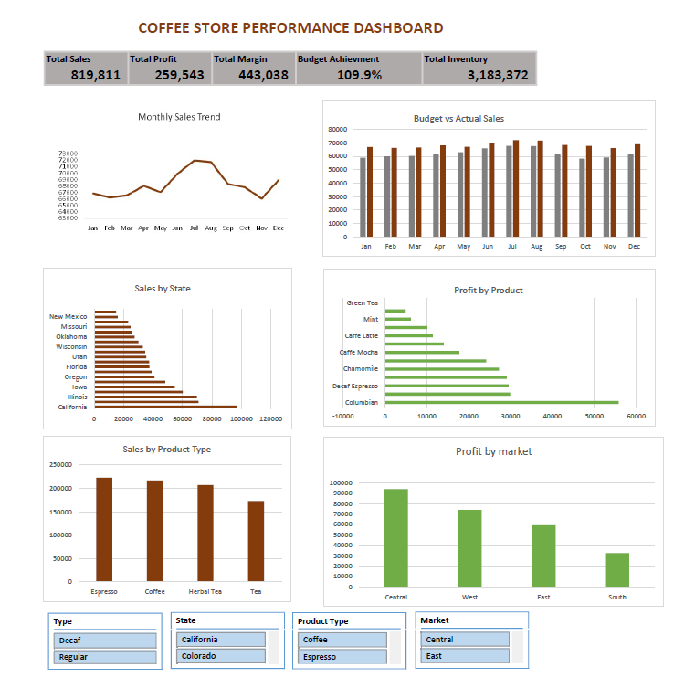

## ☕ Coffee Store Performance Dashboard

Interactive Excel Dashboard for Sales, Profitability & Business Performance Analysis

---------------------------------

## 📌 Project Overview

This project demonstrates an end-to-end data analysis workflow using Microsoft Excel.

The objective was to analyze coffee store business performance by exploring sales trends, product profitability, regional performance, budget achievement, and inventory levels. The final outcome is an interactive dashboard that supports business decision-making through KPIs, Pivot Tables, Pivot Charts, and Slicers.

## 🎯 Business Problem

The management of the coffee store needs a single dashboard to monitor overall business performance.

The dashboard should answer questions such as:

- Are sales increasing over time?
- Which products generate the highest profit?
- Which states perform the best?
- Are actual sales meeting budget targets?
- Which markets contribute the highest profitability?
- How can business performance be improved?

## ✅ Project Objectives

- Analyze monthly sales performance.
- Compare budget sales with actual sales.
- Identify high-performing states and markets.
- Evaluate product profitability.
- Monitor inventory performance.
- Build an interactive dashboard using Excel.
- Generate actionable business insights and recommendations.

## 📂 Dataset Information

The dataset contains coffee store transactional data including:

- Sales
- Profit
- Margin
- Inventory
- Budget Sales
- Marketing Expenses
- Product Type
- Market
- State
- Date

The dataset was cleaned before analysis to ensure accurate reporting and dashboard creation.

## 🛠️ Tools & Skills Used

- Microsoft Excel
- Pivot Tables
- Pivot Charts
- Slicers
- Data Cleaning
- Dashboard Design
- Business Analysis
- Data Visualization

## 📊 Dashboard Preview

## 📈 Key Performance Indicators

- Total Sales
- Total Profit
- Total Margin
- Budget Achievement
- Total Inventory

## 📈 Dashboard Features

✔ Interactive KPI Cards
✔ Dynamic Slicers
✔ Pivot Tables
✔ Pivot Charts
✔ Business Insights
✔ Recommendations

